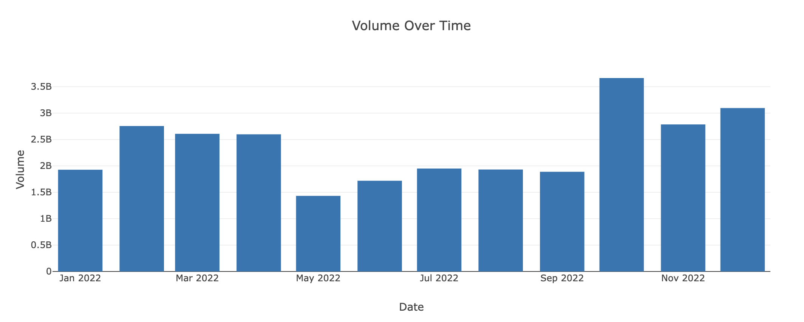
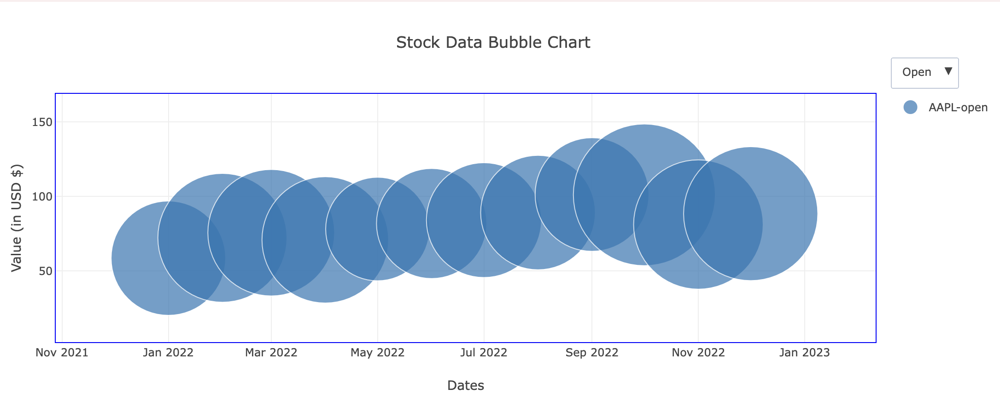
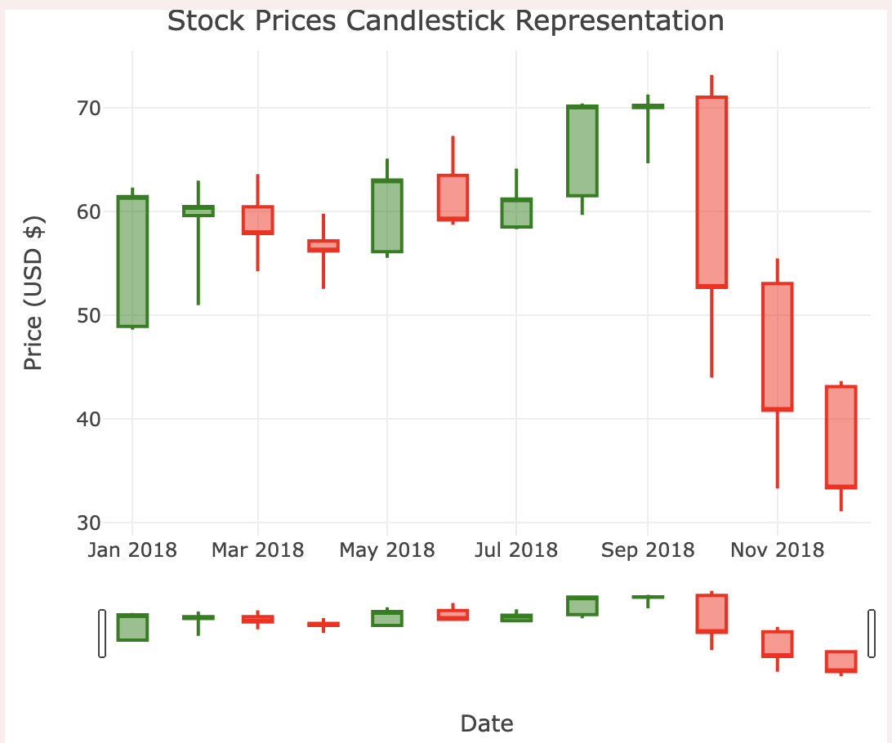
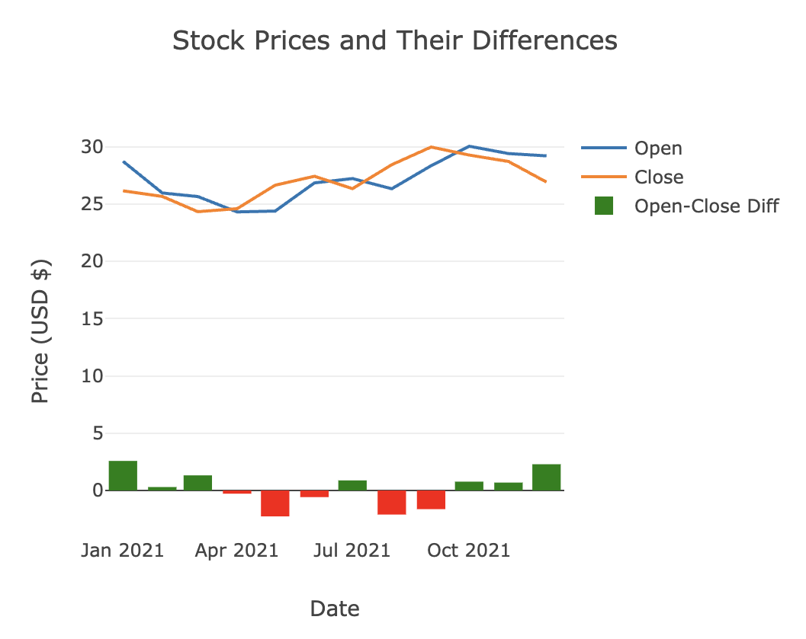
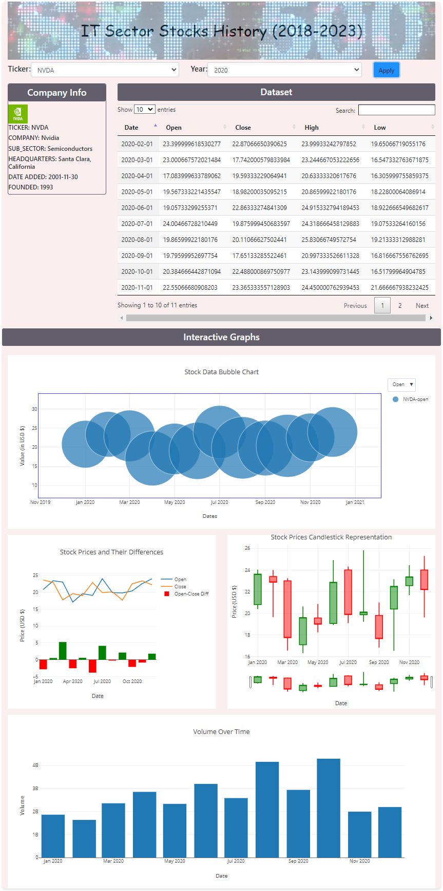

# Project3_Group 2: S&P 500 Dashboard & Analysis
### Group members: 
Arefin Shamsil [https://github.com/Arefinster]

Rita Nguyen [https://github.com/tnguy25]

Owagboe Olusoga [https://github.com/ALKEBULANPRIEST]

Ellis Zimmer [https://github.com/elliszimmer]

## Project Introduction & Objective
The goal of this project is to create an interactive web-based dashboard that will display selected companies from the S&P Index. The dashboard will consist of two dropdown bars where users can select the company ticker and the year. When applied the dashboard will produce multiple charts containing the volume and price of stock over a period of time, the difference of open and close prices, the price of stock movement from month to month and the volume of stock throughout the year.

Web link for the deployed dashboard app:
https://elliszimmer.github.io/Project3_Group2/

## Tools
- Python Flask framework
- HTML
- CSS
   - Bootstrap.js
   - Popper.js
- JavaScript
   - Plotly.js
   - D3.js
   - JSQuery

## Project Process: 
-	Choose a dataset and scrape the data
-	Export monthly data for each selected company for 5 years (2018-2023)
-	Clean the data 
-	Compile the data into a JSON file
-	Create the dashboard with header, dropdowns and company information
-	Code the charts
-	Test and improve

<<<<<<< HEAD
## App and chart screen shots

### The charts

### The App
 

=======
## GitHub Pages
https://elliszimmer.github.io/Project3_Group2/
>>>>>>> 1b2ed16883ce82bcd02b539cabe6e22a5edabdec

## References
https://finance.yahoo.com/quote/%5EGSPC/history?fr=yhssrp_catchall 

https://en.wikipedia.org/wiki/List_of_S%26P_500_companies

Canva (app)
